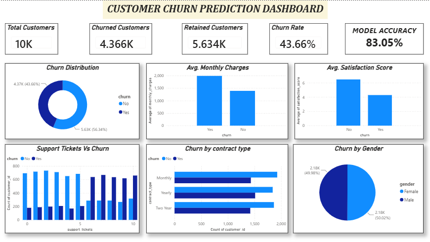

# Customer Churn Prediction

## Project Overview

This end-to-end Customer Churn Prediction project uses Python, MySQL, Machine Learning, Power BI, and GitHub to analyze customer behavior and predict customer churn. The objective is to identify customers who are likely to leave a company based on factors such as tenure, monthly charges, support tickets, satisfaction score, contract type, and internet service.

---

## Dashboard Preview

---

## Tech Stack

* Python
* Pandas
* NumPy
* MySQL
* SQL
* Scikit-Learn
* Power BI
* GitHub

---

## Dataset Information

The dataset contains 10,000 customer records with the following features:

* customer_id
* gender
* age
* tenure
* monthly_charges
* total_charges
* contract_type
* internet_service
* payment_method
* support_tickets
* satisfaction_score
* churn

---

## Project Workflow

1. Generated synthetic customer dataset using Python and Faker.
2. Created and managed customer data in MySQL.
3. Performed SQL-based churn analysis and KPI calculations.
4. Conducted Exploratory Data Analysis (EDA) using Pandas.
5. Built a Logistic Regression model for churn prediction.
6. Evaluated model performance using Accuracy, Precision, Recall, and F1-Score.
7. Designed an interactive Power BI dashboard to visualize churn trends and business insights.

---

## Key Metrics

* Total Customers: 10,000
* Churned Customers: 4,366
* Retained Customers: 5,634
* Churn Rate: 43.66%
* Model Accuracy: 83.05%

---

## SQL Analysis Performed

* Total Customer Analysis
* Churn Distribution
* Churn Rate Calculation
* Average Monthly Charges Analysis
* Customer Satisfaction Analysis
* Contract Type Analysis
* Internet Service Analysis
* Support Ticket Analysis

---

## Machine Learning Model

Algorithm Used:

* Logistic Regression

Model Performance:

* Accuracy: 83.05%
* Precision: 0.81
* Recall: 0.80
* F1-Score: 0.80

---

## Key Business Insights

* Customers with lower satisfaction scores are more likely to churn.
* Customers paying higher monthly charges show higher churn rates.
* Support tickets have a strong relationship with customer churn.
* Customer retention improves with higher satisfaction scores.
* Churn prediction can help businesses take proactive retention measures.

---

## Project Structure

customer_churn_prediction

├── data
│   ├── raw
│   │   └── customer_churn.csv
│   └── processed
│       └── churn_predictions.csv

├── python
│   ├── generate_dataset.py
│   ├── eda.py
│   └── churn_model.py

├── sql
│   ├── schema.sql
│   └── analysis_queries.sql

├── powerbi
│   └── Customer_churn_prediction.pbix

├── images
│   └── churn_dashboard.png

└── README.md

---

## Author
Kashish Jain